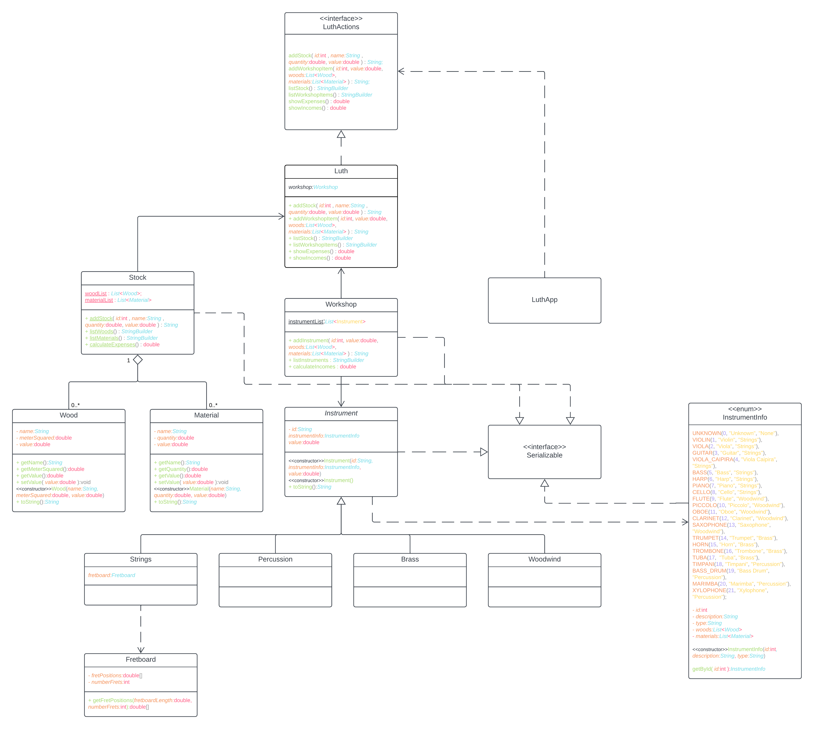

# luth
Descrição

O Luth é um projeto desenvolvido para auxiliar luthiers em seu processo de criação de instrumentos musicais. Este sistema oferece funcionalidades para gerenciar o estoque de materiais, acompanhar o progresso na construção de instrumentos e manter um registro organizado das criações. Com o Luth, luthiers podem otimizar seu fluxo de trabalho, garantindo eficiência e precisão em todas as etapas do processo.

Funcionalidades

    Gestão de Estoque:
        Adicionar, editar e excluir materiais.
        Registrar a quantidade disponível de cada material.
        Acompanhar o uso de materiais em projetos específicos.

    Criação de Instrumentos:
        Iniciar novos projetos de instrumentos.
        Acompanhar o progresso na construção de cada instrumento.
        Registrar informações detalhadas sobre cada criação.

    Relatórios e Estatísticas:
        Gerar relatórios sobre o uso de materiais.
        Visualizar estatísticas sobre o tempo gasto em diferentes fases de construção.

UML (Modelo de Linguagem de Modelagem Unificada)

A estrutura do sistema pode ser visualizada na imagem a seguir.

Como Contribuir

Sinta-se à vontade para contribuir para o desenvolvimento do Luth! Aqui estão algumas maneiras de contribuir:

    Relate Problemas:
        Se encontrar algum bug ou tiver uma ideia para melhorar o sistema, abra uma issue.

    Faça Fork e Envie Pull Requests:
        Se desejar implementar novos recursos ou corrigir problemas existentes, faça um fork do repositório e envie um pull request.

    Melhore a Documentação:
        A documentação é crucial. Se você encontrar áreas que podem ser melhoradas ou tiver informações adicionais, sinta-se à vontade para contribuir.
